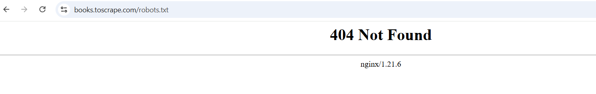
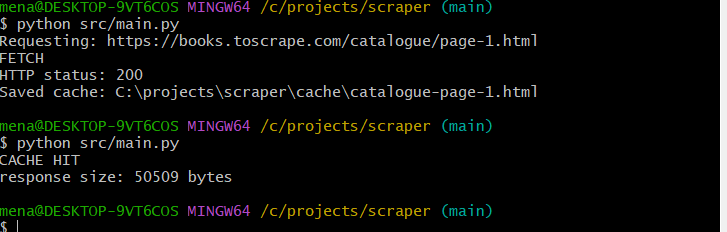

# The polite scraper

 Download three catalogue pages from a practice sandbox, visit all 60 book pages, turn messy HTML into clean, checked JSON

### Requirements

- Python 3.10+
- Requests
- Beautiful Soup
- Pydantic

### Check before you collect

Clone the repository and navigate into the project.
Install all necessary dependencies listed in requirements section.

### Open toscrape.com and read what the site says about itself

When visiting website it literaly says:

"A fictional bookstore that desperately wants to be scraped. It's a safe place for beginners learning web scraping and for developers validating their scraping technologies as well. Available at: books.toscrape.com"

So yes this site is for scraping practice.

### Request https://books.toscrape.com/robots.txt once and write down what happened

When  visiting the site this screen appears:


```text
404 Not found
```



So it seams there is no robot.txt file found.


### Target classification

Site: Books to Scrape — https://books.toscrape.com/

Why: Books to Scrape is a fictional bookstore sandbox for learning and testing web scraping.

How much: The first 3 catalogue pages will be processed, which contain 20 books each, for a maximum of 60 books

Data collected: Book title, price, availability, rating, product URL, and other relevant book details available on each product page.

The site is designed for scraping practice, so this assignment uses a purpose-built sandbox.

### Disclaimer

I will not reuse this code on another site without checking its rules and terms first.


## Fetch once, cache once

After running cript twice the output in terminal is

